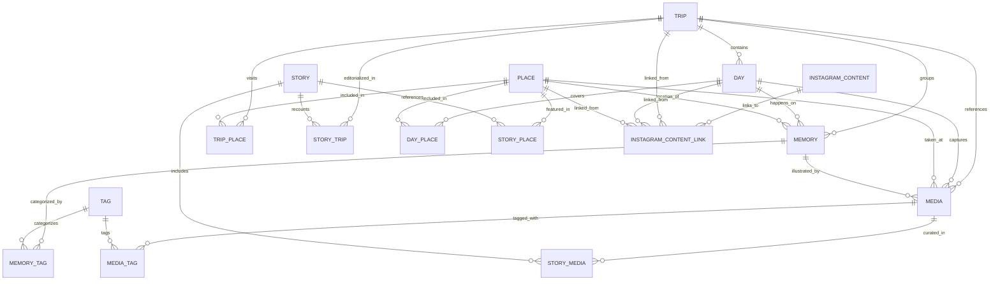

# DATA MODEL SPECIFICATION — THE JAYANT DIARIES

This document defines the canonical relational data model for **The Jayant Diaries**.

---

## 1. Entity Relationship Diagram (ERD)

---

## 2. Enums

### `visibility_type`
- `PUBLIC`: Surfaceable in public discovery, search indexable, rendered on public pages.
- `UNLISTED`: Accessible only via direct URL/slug; not shown on public indices or feeds; `noindex` header set.
- `PRIVATE`: Studio-only access. Blocked by database RLS from anonymous access.

### `trip_status`
- `DRAFT`: In-progress archival trip. Only visible in Studio.
- `PUBLISHED`: Ready for public / unlisted consumption.
- `ARCHIVED`: Historic trip archived from active feeds.

### `media_type`
- `PHOTO`: Still image (.jpg, .png, .webp, .heic).
- `VIDEO`: Motion video (.mp4, .mov, .webm).
- `REEL`: 9:16 vertical short-form video.
- `STORY`: Ephemeral or 24-hour style vertical clip.
- `AUDIO`: Field recording / ambient audio (.mp3, .m4a, .wav).
- `DOCUMENT`: Map scan, permit, ticket, or travel document (.pdf).

### `instagram_type`
- `POST`: Single static post.
- `REEL`: Short-form 9:16 video reel.
- `CAROUSEL`: Multi-slide photo/video post.

---

## 3. Core Tables

### 3.1 `places`
A geographic entity that exists independently of a single trip (e.g. Leh, Pangong Lake).

| Column | Type | Constraints | Description |
| :--- | :--- | :--- | :--- |
| `id` | `UUID` | `PRIMARY KEY DEFAULT gen_random_uuid()` | Unique place identifier |
| `name` | `TEXT` | `NOT NULL` | Canonical place name (e.g., "Pangong Lake") |
| `slug` | `TEXT` | `NOT NULL UNIQUE` | URL-safe slug (e.g., "pangong-lake") |
| `country` | `TEXT` | `NOT NULL DEFAULT 'India'` | Country name |
| `state` | `TEXT` | `NULL` | State or province (e.g., "Ladakh") |
| `city` | `TEXT` | `NULL` | Nearest city or district |
| `latitude` | `DOUBLE PRECISION` | `NULL` | Decimal latitude coordinate |
| `longitude` | `DOUBLE PRECISION` | `NULL` | Decimal longitude coordinate |
| `description` | `TEXT` | `NULL` | Overview of the place |
| `cover_media_id`| `UUID` | `NULL` | Foreign key to `media(id)` on delete set null |
| `created_at` | `TIMESTAMPTZ` | `NOT NULL DEFAULT now()` | Creation timestamp |
| `updated_at` | `TIMESTAMPTZ` | `NOT NULL DEFAULT now()` | Last update timestamp |

---

### 3.2 `trips`
The top-level journey entity.

| Column | Type | Constraints | Description |
| :--- | :--- | :--- | :--- |
| `id` | `UUID` | `PRIMARY KEY DEFAULT gen_random_uuid()` | Unique trip identifier |
| `title` | `TEXT` | `NOT NULL` | Journey title (e.g., "Ladakh 2026") |
| `slug` | `TEXT` | `NOT NULL UNIQUE` | URL-safe slug (e.g., "ladakh-2026") |
| `description` | `TEXT` | `NULL` | High-level summary / synopsis |
| `cover_media_id`| `UUID` | `NULL` | Foreign key to `media(id)` on delete set null |
| `start_date` | `DATE` | `NULL` | First date of the journey |
| `end_date` | `DATE` | `NULL` | Last date of the journey |
| `status` | `trip_status` | `NOT NULL DEFAULT 'DRAFT'` | Publication status |
| `featured` | `BOOLEAN` | `NOT NULL DEFAULT false` | Featured on hero / top rails |
| `visibility` | `visibility_type` | `NOT NULL DEFAULT 'PRIVATE'` | Visibility control |
| `created_at` | `TIMESTAMPTZ` | `NOT NULL DEFAULT now()` | Creation timestamp |
| `updated_at` | `TIMESTAMPTZ` | `NOT NULL DEFAULT now()` | Last update timestamp |

---

### 3.3 `days`
A specific day within a trip.

| Column | Type | Constraints | Description |
| :--- | :--- | :--- | :--- |
| `id` | `UUID` | `PRIMARY KEY DEFAULT gen_random_uuid()` | Unique day identifier |
| `trip_id` | `UUID` | `NOT NULL REFERENCES trips(id) ON DELETE CASCADE` | Associated trip |
| `day_number` | `INTEGER` | `NOT NULL CHECK (day_number > 0)` | Chronological day number (e.g., 1, 2, 3) |
| `date` | `DATE` | `NULL` | Calendar date for this day |
| `title` | `TEXT` | `NULL` | Headline for the day (e.g., "Crossing Khardung La") |
| `description` | `TEXT` | `NULL` | Brief synopsis of the day's route |
| `journal` | `TEXT` | `NULL` | In-depth journal text (Markdown / sanitized HTML) |
| `cover_media_id`| `UUID` | `NULL` | Foreign key to `media(id)` on delete set null |
| `created_at` | `TIMESTAMPTZ` | `NOT NULL DEFAULT now()` | Creation timestamp |
| `updated_at` | `TIMESTAMPTZ` | `NOT NULL DEFAULT now()` | Last update timestamp |

*Constraint*: `UNIQUE(trip_id, day_number)`

---

### 3.4 `memories`
The story behind an experience (deliberately independent from media).

| Column | Type | Constraints | Description |
| :--- | :--- | :--- | :--- |
| `id` | `UUID` | `PRIMARY KEY DEFAULT gen_random_uuid()` | Unique memory identifier |
| `title` | `TEXT` | `NOT NULL` | Memory title (e.g., "The first morning in Leh") |
| `description` | `TEXT` | `NULL` | Short memory excerpt |
| `journal` | `TEXT` | `NULL` | Story text |
| `date` | `DATE` | `NULL` | Date memory occurred |
| `trip_id` | `UUID` | `NULL REFERENCES trips(id) ON DELETE SET NULL` | Linked trip |
| `day_id` | `UUID` | `NULL REFERENCES days(id) ON DELETE SET NULL` | Linked day |
| `place_id` | `UUID` | `NULL REFERENCES places(id) ON DELETE SET NULL` | Linked place |
| `featured` | `BOOLEAN` | `NOT NULL DEFAULT false` | Featured story toggle |
| `visibility` | `visibility_type` | `NOT NULL DEFAULT 'PRIVATE'` | Visibility control |
| `created_at` | `TIMESTAMPTZ` | `NOT NULL DEFAULT now()` | Creation timestamp |
| `updated_at` | `TIMESTAMPTZ` | `NOT NULL DEFAULT now()` | Last update timestamp |

---

### 3.5 `media`
Canonical media assets. Relationships to trip/day/place/memory are deliberately nullable.

| Column | Type | Constraints | Description |
| :--- | :--- | :--- | :--- |
| `id` | `UUID` | `PRIMARY KEY DEFAULT gen_random_uuid()` | Stable internal media identifier |
| `filename` | `TEXT` | `NOT NULL` | Original uploaded file name |
| `storage_path` | `TEXT` | `NOT NULL UNIQUE` | Path in Supabase bucket (`media/{id}/original`) |
| `storage_url` | `TEXT` | `NOT NULL` | Full canonical URL or CDN URL |
| `thumbnail_url` | `TEXT` | `NULL` | Pre-generated webp thumbnail URL |
| `type` | `media_type` | `NOT NULL DEFAULT 'PHOTO'` | Media kind |
| `mime_type` | `TEXT` | `NOT NULL` | MIME type (e.g., image/jpeg) |
| `width` | `INTEGER` | `NULL` | Pixel width |
| `height` | `INTEGER` | `NULL` | Pixel height |
| `duration` | `NUMERIC(8,2)`| `NULL` | Duration in seconds for video/audio |
| `file_size_bytes`| `BIGINT` | `NULL` | Raw file size in bytes |
| `content_hash` | `TEXT` | `NULL` | SHA-256 checksum for deduplication |
| `taken_at` | `TIMESTAMPTZ` | `NULL` | Timestamp extracted from EXIF |
| `latitude` | `DOUBLE PRECISION` | `NULL` | GPS latitude from EXIF |
| `longitude` | `DOUBLE PRECISION` | `NULL` | GPS longitude from EXIF |
| `trip_id` | `UUID` | `NULL REFERENCES trips(id) ON DELETE SET NULL` | Associated trip |
| `day_id` | `UUID` | `NULL REFERENCES days(id) ON DELETE SET NULL` | Associated day |
| `place_id` | `UUID` | `NULL REFERENCES places(id) ON DELETE SET NULL` | Associated place |
| `memory_id` | `UUID` | `NULL REFERENCES memories(id) ON DELETE SET NULL` | Associated memory |
| `caption` | `TEXT` | `NULL` | Narrative caption |
| `visibility` | `visibility_type` | `NOT NULL DEFAULT 'PRIVATE'` | Visibility control |
| `created_at` | `TIMESTAMPTZ` | `NOT NULL DEFAULT now()` | Upload timestamp |
| `updated_at` | `TIMESTAMPTZ` | `NOT NULL DEFAULT now()` | Last update timestamp |

---

### 3.6 `instagram_content`
External publishing references to Instagram.

| Column | Type | Constraints | Description |
| :--- | :--- | :--- | :--- |
| `id` | `UUID` | `PRIMARY KEY DEFAULT gen_random_uuid()` | Unique record identifier |
| `instagram_url`| `TEXT` | `NOT NULL UNIQUE` | Full URL (e.g. `https://instagram.com/p/...`) |
| `shortcode` | `TEXT` | `NOT NULL UNIQUE` | Post/Reel shortcode identifier |
| `type` | `instagram_type` | `NOT NULL DEFAULT 'POST'` | Media type on Instagram |
| `caption` | `TEXT` | `NULL` | Instagram caption text |
| `published_at` | `TIMESTAMPTZ` | `NULL` | Publication timestamp on Instagram |
| `thumbnail_url`| `TEXT` | `NULL` | Cached preview image |
| `trip_id` | `UUID` | `NULL REFERENCES trips(id) ON DELETE SET NULL` | Primary trip reference |
| `day_id` | `UUID` | `NULL REFERENCES days(id) ON DELETE SET NULL` | Primary day reference |
| `place_id` | `UUID` | `NULL REFERENCES places(id) ON DELETE SET NULL` | Primary place reference |
| `featured` | `BOOLEAN` | `NOT NULL DEFAULT false` | Highlighted on public trip page |
| `created_at` | `TIMESTAMPTZ` | `NOT NULL DEFAULT now()` | Record creation timestamp |
| `updated_at` | `TIMESTAMPTZ` | `NOT NULL DEFAULT now()` | Last update timestamp |

---

### 3.7 `tags`
Categorical discovery metadata.

| Column | Type | Constraints | Description |
| :--- | :--- | :--- | :--- |
| `id` | `UUID` | `PRIMARY KEY DEFAULT gen_random_uuid()` | Tag identifier |
| `name` | `TEXT` | `NOT NULL UNIQUE` | Tag label (e.g., "Mountains", "Snow") |
| `slug` | `TEXT` | `NOT NULL UNIQUE` | URL-safe slug (e.g., "mountains") |
| `created_at` | `TIMESTAMPTZ` | `NOT NULL DEFAULT now()` | Creation timestamp |

---

### 3.8 `stories`
Human-authored editorial storytelling layer composed from archive entities (Trip → Story → Moments → Media).

| Column | Type | Constraints | Description |
| :--- | :--- | :--- | :--- |
| `id` | `UUID` | `PRIMARY KEY DEFAULT gen_random_uuid()` | Unique story identifier |
| `title` | `TEXT` | `NOT NULL` | Editorial title |
| `slug` | `TEXT` | `NOT NULL UNIQUE` | Slug for `/stories/[slug]` |
| `subtitle` | `TEXT` | `NULL` | Editorial sub-heading or intro |
| `content` | `TEXT` | `NOT NULL` | JSON stringified array of `StoryBlock` objects |
| `trip_id` | `UUID` | `NULL REFERENCES trips(id) ON DELETE SET NULL` | Associated Journey reference |
| `cover_media_id`| `UUID` | `NULL REFERENCES media(id) ON DELETE SET NULL` | Hero visual from archive |
| `featured` | `BOOLEAN` | `NOT NULL DEFAULT false` | Highlighted editorial story |
| `status` | `TEXT` | `NOT NULL DEFAULT 'DRAFT'` | Story status lifecycle (`DRAFT`, `READY`, `PUBLISHED`, `ARCHIVED`) |
| `visibility` | `visibility_type` | `NOT NULL DEFAULT 'PRIVATE'` | Visibility control |
| `published_at` | `TIMESTAMPTZ` | `NULL` | Publication timestamp |
| `created_at` | `TIMESTAMPTZ` | `NOT NULL DEFAULT now()` | Creation timestamp |
| `updated_at` | `TIMESTAMPTZ` | `NOT NULL DEFAULT now()` | Last update timestamp |

---

## 4. Junction Tables

- `trip_places` (`trip_id`, `place_id`, `created_at`)
- `day_places` (`day_id`, `place_id`, `created_at`)
- `memory_tags` (`memory_id`, `tag_id`, `created_at`)
- `media_tags` (`media_id`, `tag_id`, `created_at`)
- `story_media` (`story_id`, `media_id`, `display_order`, `created_at`)
- `story_places` (`story_id`, `place_id`, `created_at`)
- `story_trips` (`story_id`, `trip_id`, `created_at`)
- `instagram_content_links` (`instagram_content_id`, `entity_type`, `entity_id`, `created_at`)

---

## 5. Deletion & Orphan Prevention Policies

1. **Trips Deletion**:
   - Deleting a trip cascades to `days`.
   - Linked `memories` and `media` are **NOT** deleted; their `trip_id` is set to `NULL` (`ON DELETE SET NULL`) so media is never accidentally destroyed.
2. **Places Deletion**:
   - Deleting a place retains all associated media and memories by setting `place_id` to `NULL`.
3. **Media Deletion**:
   - Deleting a media record does not delete trips, days, or memories. Cover image pointers are set to `NULL`.
